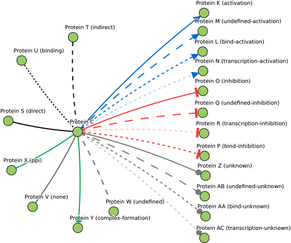
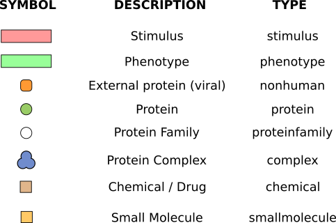

# SPV - Signaling Pathway Visualizer v1.0

## Overview
This is a Javascript library build on top of D3.js to visualize molecular interactions with particular attention to signaling pathways.

Examples (Right click to open these pages in a new window):
1) <a href="http://mentha.uniroma2.it/browser/light.php?ids=P42345,P50406&org=all" target="_blank">Protein-protein interaction network</a>
2) <a href="http://signor.uniroma2.it/pathway_browser.php?organism=&pathway_list=SIGNOR-MS&x=25&y=25" target="_blank">Signaling Network</a>
3) Try the library in <a href="http://jsfiddle.net/Sinnefa/35oocg7n/">JSFiddle</a> (Due to JSFiddle limitations not all actions are supported, also try our examples in the examples folder)

## Installation
1) Copy the js directory in where you want within your website
2) Add the following line in the webpage you want to add the visualizer to:
```html
<script>
   baseurl = "./js/";
</script>
<script src="./js/SPV_v1.0.js"></script>
```
3) Set the variable <i>baseurl</i> to the url where you copied the js/ directory. This is to find tool bar images and extra Javascript libraries used by SPV.
4) Add a ```<div></div>``` block to host the graphical representation of your network
```html
<div id="graphArea" style="width:640px;height:480px;background:white;overflow:hidden;"></div>
```
5) Define a json object listing the links of your network:
```javascript
var links = [
  {source: "Protein A", idA: "A", typeA: "protein", target: "Protein B", idB: "B", typeB: "protein", type: "none", score: 0.1},
  {source: "Protein A", idA: "A", typeA: "protein", target: "Protein C", idB: "C", typeB: "protein", type: "none", score: 0.4}
];    
```
6) If you want define a list of texts to visualize when the user clicks on nodes and edges. Edge list keys must have has key the concatenation of the two ids of the source and target node:
```javascript
var node_labels = [];
node_labels["A"] = "This is a description for <b>Protein A</b>";
node_labels["B"] = "This is a description for <b>Protein B</b>";

var edge_labels = [];
edge_labels["AB"] = "This links <b>Protein A<b> and <i>Protein B</i>";
```
7) (Optional) Push ids of the elements you want to be placed on fixed layers, or define a set of nodes that should be enveloped by hulls:
```javascript
extracellular.push('I');
factors.push('B');
receptors.push('C');
phenotypesList.push('H');

complexesList["A Sample Complex"] = ["P61964","Q9UBL3","O14686"];
```
8) Initialize the graph:
```javascript
initGraph(links, node_labels, edge_labels, "graphArea", 640, 480, "A", 1, 0, 1);
```
This will createa signaling pathway with I located outside the cell, B in the nucleus, C in the membrane and H as a Phenotype.
The node "A" will be highlighted. The first 1 sets the visualization to "signaling", 0 visualizes the tool bar and the last 1 prevents edges and labels overlaps.

## Library details

### Already Defined Edges

We defined the following markers:
1) A standard arrow for activations
2) A T shaped arrow for inhibitions
3) A circle for unknown effects
4) A square for complex formation

1, 2 and 3 can be mixed with line types, for example transcriptional-activation, transcriptional-inhibition

The following image shows aldready defined edges



### Already Defined Objects

List of possible values for the type attribute



### initGraph(links, node_labels, edge_labels, htmlPageDiv, width, height, seedNodesList=1, signalingOrPPI=0, hideToolBar=0, preventOverlap=0);
- *links*: a json object containing the graph edges, and thus nodes.
- *node_labels, edge_labels list*: arrays containing tool-tips to visualize on mouse click on edges and nodes. If empty *null* dynamical pages will be queried: *getUniprotDescription.php* and *getEvidence.php*.
- *htmlPageDiv*: is the id of the div to use to visualize the graph.
- *width* and *height* define the size of the graph.
- *seedNodesList*: a list of nodes to color in dark green representing the pathway seed proteins.
- *signalingOrPPI*: signaling=1 or PPI=0. Signaling shown the cell and basic comparments. PPI let the graph float free in space.
- *hideToolBar*: hides=1, or visualize=0 the top menu bar.
- *preventOverlap*: does not apply=0, applies=1 an algorithm to prevent labels overlap, and edges crossing other nodes
	

## Advanced use

### setContextMenu(htmlPageDiv, text)
This function allows you can to add a right-click context menu.
```javascript
setContextMenu("mydiv", "Context menu for PPI");
```

### setNodesColor(htmlPageDiv, idsList, color);
It can be used to highlight specific nodes after the visualization has been initialized. It can be used to highlight or animate the graph.

### How to define custom interactions
If you want to add a custom interaction types you need to do two things:
1) First define custom edges in the JSON graph, setting the type attibute to, for example, type:"custominteraction".
2) After calling the *initGraph* function define your CSS style (interaction classes must start with path.link-") and call the following function:
```javascript
	var cssn = "path.link-custominteraction {\n\
		z-index:10000;\n\
		fill: #ffffff;\n\
		fill-opacity: 0.01;\n\
		stroke: purple;\n\
		stroke-width: 5px;\n\
		stroke-dasharray: 1;\n\
	}";

	addEntityType("graphArea", cssn);
```
See *PPI_example.html* for an example

### How to define custom entities
If you want to add a custom entities you need to do two things:
1) First define custom entities in the JSON graph, setting the typeA and typeB attibute to, for example, typeA: "myentity".
2) Before calling the *initGraph* function define the shape of your new entity with SVG notation, new entity names must end with Shape:
```javascript
// This draws a little man
var myentityShape="m 5.0243799,-13.653959 a 6.58048,6.6052478 0 0 0 -6.5800186,6.6043992 6.58048,6.6052478 0 0 0 2.7450609,5.3600938 l -7.7475727,6.1980577 2.3116297,2.311629 6.9348902,-4.623259 0,6.934891 -9.2465199,6.9348883 2.3116297,2.311632 9.2465214,-6.934892 9.2465194,6.934892 2.31163,-2.311632 -9.2465196,-6.9348883 0,-6.934891 6.9348896,4.623259 2.31163,-2.311629 -7.7259006,-6.1809015 a 6.58048,6.6052478 0 0 0 2.7730526,-5.37725 6.58048,6.6052478 0 0 0 -6.5809221,-6.6043992 z";
```
3) After calling the initGraph function define your CSS style and call the following function:
```javascript
	var cssn = ".myentity {\n\
		stroke: #000;\n\
		stroke-width: 1px;\n\
		fill: red;\n\
	}";

	addEntityType("graphArea", cssn);
```
See *PPI_example.html* for an example

### How to import local files
SPV support the PSICQUIC tab-separated standard file format and the SIGNOR file format.
TODO: Implement these parsers to support Causal Tab when ti will be pulished

```javascript
var links_signor = csv2spv("EXAMPLE_SIGNOR_Tab-Separated.tsv","signor");
var links_signor = csv2spv("EXAMPLE_PSI-MI_Tab-Separated.tsv","psicquic");
```

The graph JSON object can be automatically created from local tab-separated files.
PSICQUIC MITAB and SIGNOR file formats are currently supported.
